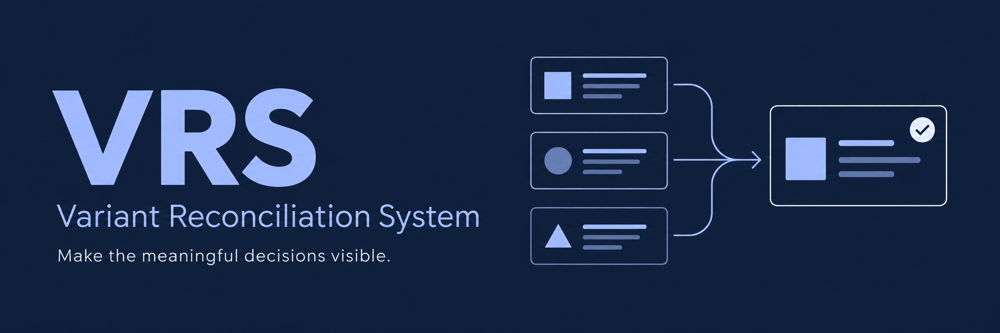
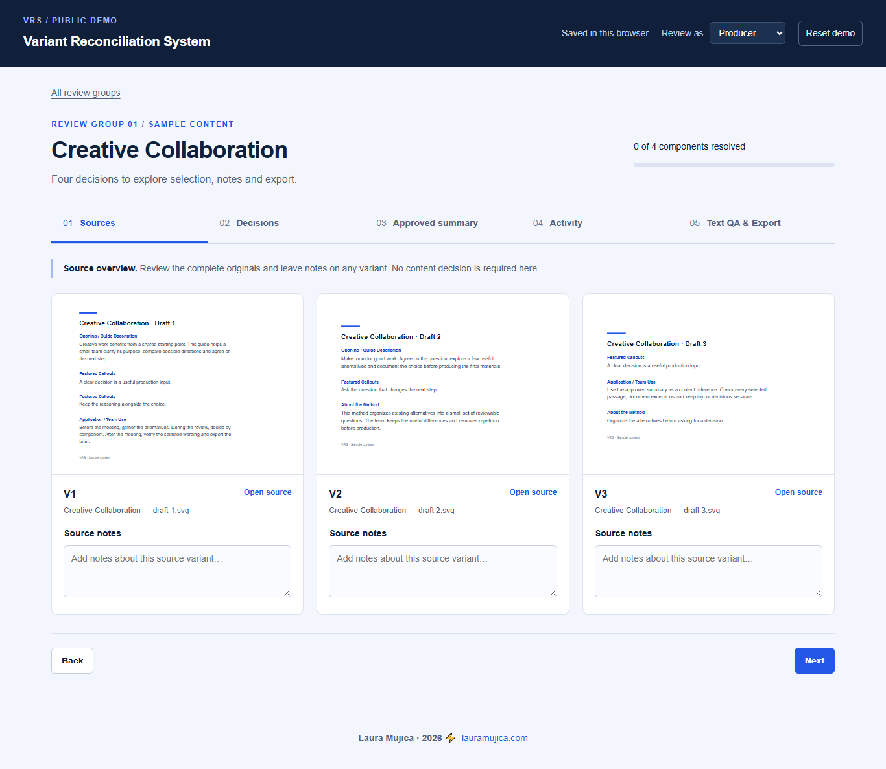

# Variant Reconciliation System

**A real creative workflow turned into a structured review tool.**

I developed the Variant Reconciliation System (VRS) during a client project with multiple AI-generated editorial variants. Before production could begin, the team needed to identify which differences mattered, decide what to preserve and establish an approved content reference.

The VRS connects source variants, component decisions, reviewer notes, approval states and a checked content handoff. Its review interface was originally called the **Variant Decision Board (VDB)**.

**By Laura Mujica · 2026**  
Creative workflow design · Content systems · AI-assisted development · Production research

[Read the case study](docs/CASE_STUDY.md) · [Open DEMO](https://laumujica.github.io/variant-reconciliation-system/) · [How the demo works](docs/DEMO_GUIDE.md)

## Why I built it

Choosing one complete page image could discard useful content from another version. Comparing every visible difference could also create unnecessary decisions: repeated text, competing definitions and compatible sections needed different treatment.

I designed a review process that separates source exploration from meaningful content decisions. Reviewers choose by component, record the relevant context and produce an approved content package before layout and production.

## The working flow

1. **Sources:** inspect complete variants and add source notes.
2. **Decisions:** choose one option or several compatible options, approve with any notes and references, select **None of these**, or exclude a component. Add reference files or links when needed. **None of these** can be approved with a supplied alternative file or link.
3. **Approved summary:** inspect the selected material and copy approved text or reference images.
4. **Activity:** review decisions and recorded actions.
5. **Text QA & Export:** check the extracted wording and export a Markdown handoff.

## A demonstration of the real system

This public edition condenses the working prototype into **3 source variants, 4 component groups and 9 options**. It demonstrates single selection, multiple selection, notes, reference links and optional exclusion, followed by Text QA and export. Original client content and assets have been replaced with sample editorial material titled *Creative Collaboration*.

| Original project | Public demonstration |
| --- | --- |
| Client-specific source material and identity | Replacement sample text, document previews and an independent visual style |
| Shared review data through Firebase Firestore | Browser-local decisions and notes |
| A separate producer/admin workflow | Text QA and export accessible for exploration |
| Real client decisions | A fresh, resettable review for each browser |

The sample material illustrates the workflow; it is not presented as a second client project. The system records human decisions. It does not automatically audit unseen files, choose content, merge wording or produce an InDesign document.

*The demo opens with an introduction before entering the component review.*

## Try it locally

Open `demo/index.html` in a modern browser. No installation or account is required. To use a local HTTP server, run `npm run serve` and open the address it prints.

To explore the whole flow, follow the [demo guide](docs/DEMO_GUIDE.md). Decisions remain in the current browser. **Reset demo** clears this demo’s decisions, notes and attachments after confirmation. Attached files remain in the visitor’s browser; the Markdown export includes file names and reference links, with files available to download separately.

## Project files

| File or folder | Purpose |
| --- | --- |
| `demo/index.html` | Review interface |
| `demo/styles.css` | Independent visual styling and responsive layout |
| `demo/app.js` | Review engine adapted from v54 |
| `demo/fixtures.js` | Replacement content and source/component relationships |
| `demo/assets/` | Sample source documents and component previews |
| `docs/CASE_STUDY.md` | Project story, role, areas of work, results and limitations |
| `docs/DEMO_GUIDE.md` | A short walkthrough of the public demonstration |
| `docs/VALIDATION.md` | Validation results and remaining checks |
| `scripts/check.mjs` | Content, isolation and workflow checks |
| `scripts/serve.mjs` | Dependency-free local server |

## Technology and scope

HTML, CSS and vanilla JavaScript. The original project used Firebase Firestore for shared persistence and Vercel for online access. This public edition has no backend connection or runtime dependencies.

The broader project also covered content auditing, visual and technical production rules, print tests, editable InDesign reconstruction experiments and specialist handoff. Those areas are documented in the case study; they are not implemented as features of this demo.

---

**Laura Mujica · 2026 ⚡**  
[lauramujica.com](https://lauramujica.com/)
